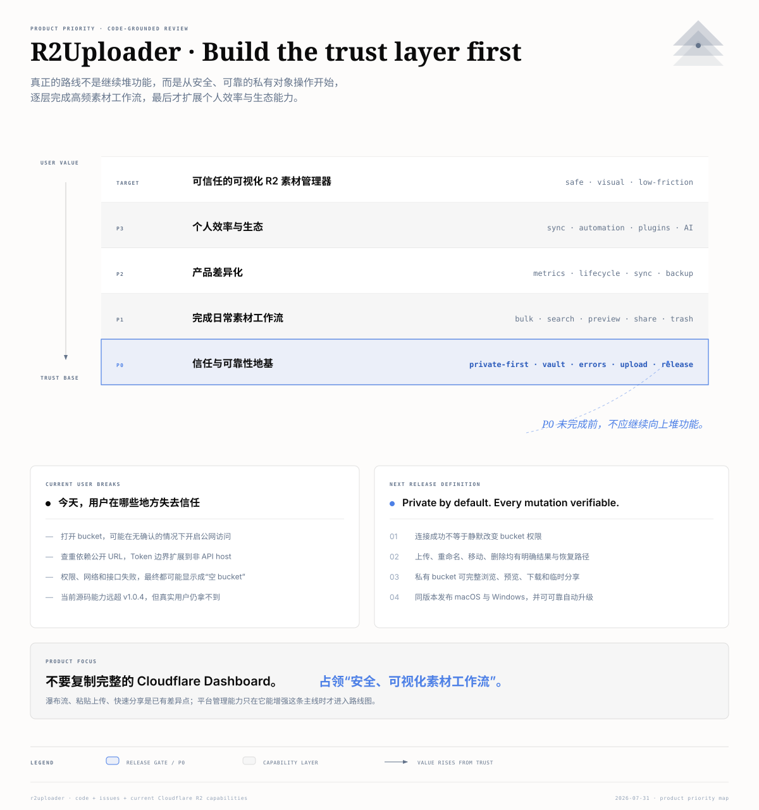

# R2Uploader 产品优化审视报告

> 审视日期：2026-07-31<br>
> 审视对象：`main` 分支 `162131c`，源码版本号 `1.0.4`<br>
> 方法：用户故事拆解、关键代码路径审查、公开用户反馈核对、Cloudflare R2 官方能力核对、生产构建验证

## 一、结论先行

R2Uploader 最值得成为的产品，不是一个缩小版 Cloudflare Dashboard，而是：

> **一个 private-first、低摩擦、面向素材工作流的 Cloudflare R2 桌面管理器。**

它当前已经有明显的产品雏形：视觉化浏览、粘贴上传、拖拽上传、前缀搜索、文件夹、复制链接、导出和右键操作。这些能力共同指向“素材管理器”，而不是“通用云平台控制台”。

但当前最大的产品问题不是功能数量，而是**产品承诺与底层行为不一致**：

1. 用户只是打开现有 bucket，应用就可能自动开启公开访问。
2. 浏览、查重、重命名、下载等关键能力依赖公开 URL，私有 bucket 不能成为一等公民。
3. 权限、网络或接口失败可能被呈现成“空 bucket”，用户无法判断数据是否真的不存在。
4. 上传后的改名与对象重命名缺少完整事务保证，存在原对象被提前删除或新旧对象同时存在的风险。
5. 源码已经比公开发布版前进 29 个提交，但版本号仍是 `1.0.4`；用户下载到的产品不等于当前源码能力。

因此，优先级必须是：

**P0 信任与可靠性 → P1 日常素材工作流 → P2 产品差异化 → P3 个人效率与生态扩张。**

已确认的产品边界：不把团队工作区、成员管理、RBAC 或团队审计纳入正式路线图。



## 二、产品定位与核心用户故事

### 2.1 最适合优先服务的用户

| 用户 | 主要任务 | 现有替代方案 | R2Uploader 应提供的价值 |
|---|---|---|---|
| 独立开发者、博客作者 | 上传网站素材、复制 URL、调整文件名和目录 | Cloudflare Dashboard、CLI、脚本 | 比 Dashboard 更快，比 CLI 更直观 |
| 设计师、内容创作者 | 浏览图片和视频、粘贴截图、导出和分享 | 本地文件夹、图床、对象存储控制台 | 像本地素材库一样使用 R2 |
| 第一次接触 R2 的非技术用户 | 配置连接、上传第一个文件、获得可用链接 | 阅读文档、寻找教程 | 引导完成，而不是要求理解 Cloudflare 内部概念 |

### 2.2 四条核心用户故事

1. **首次连接**

   作为第一次使用 R2 的用户，我希望应用告诉我需要哪种凭据、权限是否足够、凭据会保存在哪里，使我不需要反复猜测 Cloudflare 配置。

2. **私有浏览**

   作为存储私有素材的用户，我希望不公开 bucket 也能浏览、预览、下载、上传和整理对象，而且应用不会背着我改变公开访问状态。

3. **高频素材处理**

   作为每天上传素材的用户，我希望拖入、粘贴、重命名、移动、批量选择和复制链接都足够快，并且失败后知道怎样恢复。

4. **安全分享**

   作为需要发给他人的用户，我希望明确选择“永久公开链接”或“限时私有链接”，知道链接何时失效、谁可能访问。

## 三、当前能力：源码里已经有什么

| 能力 | 当前实现 | 产品判断 |
|---|---|---|
| 账号连接 | Account ID、R2 Token、License 三项输入 | 可用，但凭据类型、权限诊断和失败解释不足 |
| bucket 列表 | 拉取 bucket，并缓存 bucket 和域名信息 | 基础能力存在 |
| 创建 bucket | 支持位置选择 | 创建后自动尝试开启公开域名，不符合安全默认值 |
| 删除 bucket | 支持删除及失败提示 | 对话框声称会删除全部内容，但后端实际上只能删除空 bucket |
| 对象浏览 | 四列 Masonry 图片墙 | 有鲜明产品特色，但对大目录、不同窗口尺寸和非图片对象不够稳健 |
| 文件夹 | 使用 delimiter 浏览；创建时写入 `default.txt` | 能工作，但占位对象会污染真实数据 |
| 搜索 | 500ms 防抖的 prefix 查询 | 基础可用，不是全文或结果型搜索 |
| 上传 | 文件选择、对话框内拖拽、多文件、失败重试 | 缺少真实进度、取消、并发控制、大文件策略和可靠查重 |
| 粘贴上传 | 捕获剪贴板图片并自动命名 | 是差异化能力，值得强化 |
| 覆盖保护 | 上传前通过公开 URL 发 HEAD | 判断来源不可靠，并与“必须公开”耦合 |
| 重命名 | 下载旧对象、上传新 key、删除旧对象 | 源码已有，但事务保证不足，且尚未进入公开发布版本 |
| 复制与导出 | 复制公开 URL、复制图片/文本内容、导出 | 高频价值明确，但只适用于可公开读取的对象 |
| 预览 | 图片直接显示；其他类型主要显示图标 | `VideoRenderer` 已存在，但当前调用路径没有真正启用视频预览 |
| 自动更新 | GitHub Releases + `electron-updater` | 机制存在，但版本与发布流程没有形成闭环 |
| 国际化 | 界面主要为英文 | 已有中文用户直接提出国际化需求 |

## 四、用户旅程中的真实断点

### 4.1 连接：用户不知道自己到底连接成功了没有

`renderer/pages/home.tsx:43-66` 在启动时请求 bucket；只有 `success` 为真时才更新状态，没有把 API 错误呈现给用户。手动 Launch 时，任何导致结果为空的情况最后都可能显示 `No buckets found`（`renderer/pages/home.tsx:94-105`）。

这会把以下完全不同的问题混在一起：

- 账号下真的没有 bucket；
- Account ID 错误；
- Token 类型不对；
- Token 权限不足；
- 网络不可用；
- Cloudflare API 发生变化；
- 服务端限流或临时故障。

这不是单纯的错误文案问题。对非技术用户而言，“空数据”会直接变成“我是不是把文件弄丢了”。

公开反馈已经验证了这一点：

- [Issue #2：能找到 bucket，但有对象的 bucket 显示 No object found](https://github.com/maoxiaoke/r2Uploader/issues/2)
- [Issue #3：部分 bucket 能打开，另一个有数据的 bucket 显示为空](https://github.com/maoxiaoke/r2Uploader/issues/3)

### 4.2 打开 bucket：阅读动作被偷偷变成了公开动作

`renderer/pages/home.tsx:113-130` 的 `openBucket` 会检查 managed domain；如果没有启用，就调用 `cf-enable-managed-domain`。后者在 `main/ipc/cf-service.ts:365-399` 向 Cloudflare 发送 `enabled: true`。

创建 bucket 也会在成功后自动执行相同动作（`main/ipc/cf-service.ts:418-447`）。界面只在创建对话框底部写了一句 “Buckets are publicly accessible by default”（`renderer/components/create-bucket.tsx:95-96`），没有提供私有选项。

Cloudflare 官方说明与当前产品行为相反：

- R2 bucket 默认不会公开，公开访问需要用户明确启用。
- `r2.dev` 是开发用途的公开入口，开启后对象会暴露到互联网，而且该入口受到限流。

参考：[Cloudflare R2 Public buckets](https://developers.cloudflare.com/r2/buckets/public-buckets/)

从用户角度看，这属于 P0：用户只是“打开看看”，不应产生资源权限变更。

### 4.3 Token 的信任边界过大

`main/ipc/cf-service.ts:28-70` 的 `_fetch` 会给收到的任意 URL 添加：

```text
Authorization: Bearer <R2 Token>
```

而 `cf-check-file-exists` 允许调用方直接传入 URL（`main/ipc/cf-service.ts:282-291`）。上传、粘贴、创建文件夹和重命名会把 `publicDomain` 拼出的 URL传进去；`publicDomain` 可能是自定义域名。

因此，代码路径上存在把 Cloudflare Token 发送给非 Cloudflare API host 的风险。这里的判断是**代码风险**，不是已经观察到 Token 泄漏的结论，但其严重性足以成为发布阻断项。

与此同时：

- Token 明文写入 `~/r2uploader/r2uploader.json`（`main/helpers/get-config.ts:7-38`）。
- `get-config` 会把完整配置返回 renderer（`main/ipc/config.ts:7-13`）。
- Token 输入框没有使用密码类型（`renderer/pages/home.tsx:259-267`）。
- preload 暴露了不带 channel allowlist 的通用 `send`、`on` 和 `invoke`（`main/preload.ts:3-17`）。

正确产品承诺不应只停留在“Token 不会上传到我们的服务器”，还应该是：

> Token 使用系统安全存储，只留在 main process，只发送给经过 allowlist 验证的 Cloudflare endpoint。

### 4.4 私有 bucket 不是一等公民

对象页先从 bucket 域名组装 `publicDomain`（`renderer/pages/bucket/[name]/delimiter/[[...delimiter]].tsx:55-65`），随后把它用于：

- 图片预览；
- 文件存在性检查；
- 浏览器打开；
- 导出；
- 复制文件内容；
- 文件重命名时下载旧对象；
- 生成分享 URL。

如果没有公开域名，就可能得到 `https://undefined/...`；如果保持 bucket 私有，上述链路无法正常工作。

Cloudflare 当前已经支持用 S3 API 访问私有对象，也支持生成 1 秒至 7 天有效的 GET、PUT、HEAD、DELETE 预签名 URL。参考：

- [Cloudflare R2 S3 API](https://developers.cloudflare.com/r2/get-started/s3/)
- [Cloudflare R2 Presigned URLs](https://developers.cloudflare.com/r2/api/s3/presigned-urls/)

因此，私有浏览不是需要等待平台能力的愿望，而是当前可以实现的产品基础。

### 4.5 上传：界面显示了状态，但没有形成可靠传输系统

当前上传体验有一些好基础：多文件、拖拽、重试、覆盖、改名、粘贴上传。

但实现上仍有这些断点：

- `progress` 字段存在，却没有实际更新。
- 界面写着不超过 300MB，但代码没有检查 300MB 限制。
- 多文件通过 `forEach` 同时启动（`renderer/components/file-upload.tsx:247`），没有并发控制和统一完成状态。
- 没有取消、暂停或恢复。
- 失败只归类为 `file_exists` 或 `upload_failed`。
- 覆盖判断依赖公开 URL 的 HEAD，而不是经过认证的对象元数据请求。
- 对大文件没有 multipart 上传；Cloudflare 官方支持 multipart，单 part 5MiB 至 5GiB，最多 10,000 parts。参考：[Upload objects](https://developers.cloudflare.com/r2/objects/upload-objects/)。

### 4.6 重命名：UI 成功不等于远端状态正确

主进程重命名步骤是：

1. 从公开 URL 下载旧对象；
2. 上传新 key；
3. 删除旧 key。

`main/ipc/cf-service.ts:543-552` 没有读取和检查删除旧对象的响应。上传成功但删除失败时，函数仍返回成功，UI 会把旧对象直接改名为新对象；远端实际可能同时存在两个对象。

上传对话框中的“上传后改名”风险更高：

- `renderer/components/file-upload.tsx:288-301` 检查的是旧文件 URL；
- 随后不等待删除请求完成，就开始以新名称上传；
- 如果新名称冲突或上传失败，原对象可能已经被删除。

用户视角下，重命名是一个动作，不应该让用户理解“下载—上传—删除”的内部过程。产品必须保证：

- 新对象验证成功以前绝不删除旧对象；
- 删除失败要明确显示“复制成功，但旧对象未删除”；
- 任一步失败后都能重试或恢复；
- UI 状态来自服务端复核，不是本地乐观改名。

### 4.7 删除：缺少准确语义和恢复路径

删除 bucket 的对话框说会删除 bucket 和全部远端文件（`renderer/components/delete-bucket.tsx:51-60`），但 Cloudflare 在 bucket 非空时返回错误，代码也专门处理了 `10008`。

对象删除则只有通用确认框，详情中还残留了与当前产品无关的 `nazha-online`（`renderer/components/file-with-skeleton.tsx:86-115`）。

这里应同时修复：

- 真实语义；
- 精确对象和 bucket 名称；
- 批量删除的影响范围；
- “移入回收站”或备份策略；
- 操作结果验证。

### 4.8 文件夹：能导航，但还不像真正的文件管理器

当前通过 delimiter 模拟文件夹，创建文件夹时上传 `default.txt`（`main/ipc/cf-service.ts:573-588`）。这能让空前缀存在，但会把实现细节作为真实对象暴露给其他 R2 客户端。

此外，文件夹容器使用 `flex gap-4` 而没有 wrap（`renderer/pages/bucket/[name]/delimiter/[[...delimiter]].tsx:319`）。这已经产生真实用户问题：

- [Issue #5：文件夹单行排列并被屏幕裁掉](https://github.com/maoxiaoke/r2Uploader/issues/5)

文件夹的创建、重命名、移动、删除和空目录语义应该被作为一个整体设计，而不是继续叠加占位文件补丁。

### 4.9 License 与开源承诺不一致

README 同时写着：

- 需要购买并输入 license；
- “We require you to provide a license key, but you can still use it for free”；
- 项目使用 GPL v3。

但 `renderer/pages/home.tsx:79-85` 会在未激活 License 时直接阻止 Launch。公开 Issue 也已经出现质疑：

- [Issue #4：GPL v3 与付费 License 的关系是什么](https://github.com/maoxiaoke/r2Uploader/issues/4)

这里不是简单改一段文案，而是需要明确商业模型：

- 开源版能否免费使用；
- License 解锁什么；
- 付费是购买二进制、自动更新、支持，还是高级能力；
- 源码自行构建与官方发行版分别是什么关系。

在这个问题回答清楚前，不适合继续强化强制激活。

### 4.10 源码、版本号与用户拿到的版本不一致

当前状态：

- `package.json` 仍为 `1.0.4`。
- 最新 GitHub Release `v1.0.4` 发布于 2025-03-10，对应提交 `8b3a523`。
- 当前 `main` 为 2025-11-29 的 `162131c`。
- `v1.0.4..HEAD` 有 29 个提交、约 2,575 行新增代码。
- 文件重命名、粘贴上传、拖拽、缓存数据和新 Masonry 等源码能力没有进入最新 Release。
- `v1.0.4` Release 只有 macOS 产物；README 的 Windows 链接仍固定到 `1.0.3`。
- `electron-builder.yml:29` 明确关闭 notarization。

这会产生两个产品后果：

1. 开发者看到的“产品现状”和用户实际安装的“产品现状”不是同一个东西。
2. 自动更新依赖版本号；源码不更新版本号，就无法建立可靠升级路径。

## 五、优先级定义

| 优先级 | 判断标准 | 产品含义 |
|---|---|---|
| P0 | 可能造成公开暴露、凭据风险、数据丢失、错误认知，或阻断正常使用 | 不完成就不应发布下一版 |
| P1 | 高频任务存在明显摩擦，直接决定产品是否能日常使用 | P0 后立即完成 |
| P2 | 建立“素材管理器”差异化，提高留存和付费价值 | 在核心工作流稳定后投入 |
| P3 | 个人效率、生态或跨平台扩张 | 有留存和真实需求后再做 |

本报告没有使用伪精确的 RICE 分数，因为仓库当前没有使用频次、转化率或留存数据。排序主要依据：

1. 风险是否不可逆；
2. 影响用户范围；
3. 用户故事发生频率；
4. 是否阻塞后续功能；
5. 是否已有真实用户证据；
6. 实现复杂度与产品收益的比例。

## 六、完整功能清单

### P0：信任与可靠性地基

| 顺序 | 功能 | 用户故事与价值 | 完成标准 |
|---:|---|---|---|
| P0-01 | Private-first bucket | 我打开或创建 bucket 时，默认保持私有，不发生隐式公开 | 打开、浏览不会改变域名状态；创建时默认 Private；开启公开需独立确认 |
| P0-02 | 认证对象访问层 | 我不公开 bucket 也能浏览、预览、上传、下载、查重和重命名 | 所有对象操作通过认证 API/S3 Client；公开域名不再是基础依赖 |
| P0-03 | 安全凭据保险库 | 我的 Token 不以明文出现在文件、renderer 或任意外部 host | 使用系统安全存储；main process 独占 Secret；host allowlist；完成旧配置迁移 |
| P0-04 | 连接测试与权限诊断 | 我输入凭据后能立刻知道账号、Token 类型和权限是否正确 | 分别检测账号、列 bucket、读对象、写对象权限；显示可执行修复建议 |
| P0-05 | 统一错误模型 | 失败时我知道是网络、认证、权限、限流、接口还是空数据 | 空状态只用于真实空结果；所有请求返回 typed error、request id、重试入口 |
| P0-06 | 可靠对象存在性检查 | 应用不会因为 CDN 缓存或公开 URL 状态误判冲突 | 用认证 HEAD/metadata 检查；正确编码 key；冲突结果显示对象详情 |
| P0-07 | 原子化重命名与移动 | 改名或移动失败不能丢失原文件 | 先 Copy/Put、验证目标，再删源；检查删除结果；部分成功有明确恢复操作 |
| P0-08 | 可靠上传引擎 | 上传过程真实可见、可停止、可重试，界面承诺与行为一致 | 真实进度、取消、并发上限、失败原因、大小校验；大文件使用 multipart |
| P0-09 | 安全删除与恢复 | 删除前知道范围，误删后有恢复机会 | 精确确认；默认回收站/备份策略；永久删除二次确认；服务端结果复核 |
| P0-10 | 可见的访问状态 | 我随时知道对象是私有、永久公开还是限时分享 | bucket 和对象均显示状态；永久链接与临时链接使用不同动作和视觉 |
| P0-11 | 修复已确认可用性缺陷 | 有对象时不再显示空；所有文件夹都能访问；窗口能正常拖动 | 覆盖 GitHub Issues #2、#3、#5 的回归测试 |
| P0-12 | 发布版本闭环 | macOS 与 Windows 用户拿到同一提交、同一版本的产品 | CI 产出双平台；版本自动校验；签名/公证；更新清单；失败可回滚 |
| P0-13 | License 与开源策略 | 我知道什么免费、什么付费，激活失败不会让我怀疑软件不可用 | 产品策略、README、GPL 说明、购买页和应用行为一致 |
| P0-14 | Electron 安全基线 | 远程内容或 renderer 问题不能调用任意本地能力 | IPC channel allowlist、参数 schema、CSP、导航限制、URL allowlist、sandbox 评估 |
| P0-15 | 可诊断支持包 | 出现问题时我能安全地导出诊断信息给维护者 | 脱敏日志、版本/平台/网络状态、最近失败请求；绝不包含 Token |
| P0-16 | URL 与对象 key 正确编码 | 文件名包含空格、中文、`#`、`?`、`&` 时仍能可靠操作 | 所有 path segment 与 query 参数按协议编码；加入特殊 key 测试 |
| P0-17 | 依赖安全治理 | 已知依赖风险不会长期累积 | 生产依赖审计、适用性判断、升级和例外记录；CI 阻断新增高危问题 |

### P1：完成日常素材工作流

| 顺序 | 功能 | 用户故事与价值 | 完成标准 |
|---:|---|---|---|
| P1-01 | 全局传输中心 | 我能看到所有上传和下载，而不是只能盯着一个对话框 | 队列、速度、进度、剩余时间、暂停/取消/重试、完成历史 |
| P1-02 | 页面级拖拽上传 | 我把文件拖到当前目录就能上传，不必先打开弹窗 | 整个对象区可接收；明确显示目标路径；拖入文件夹可改变目的地 |
| P1-03 | 文件夹递归上传 | 我能直接上传本地文件夹并保留层级 | 支持目录选择和拖入；冲突策略可批量应用 |
| P1-04 | 多选与批量操作 | 我能一次导出、删除、移动、复制或生成链接 | Shift/Cmd 选择、框选、全选；操作前显示数量和总体积 |
| P1-05 | 完整文件夹操作 | 我能创建、重命名、移动、复制和删除文件夹 | 不向用户暴露 `default.txt`；明确定义空目录兼容方式 |
| P1-06 | 移动与复制对象 | 我能在 bucket 内或 bucket 间整理对象 | 支持目标选择、冲突处理、进度和部分失败恢复 |
| P1-07 | 排序与筛选 | 我能按名称、时间、大小、类型快速整理内容 | 多字段排序；类型/日期/大小筛选；状态持久化 |
| P1-08 | 可理解的搜索 | 我知道搜索范围、搜索语义以及为什么没有结果 | 当前目录/全 bucket 切换；prefix 说明；结果数量；清除和历史 |
| P1-09 | 列表与网格双视图 | 图片用网格，文档和大目录用列表 | 视图切换；列表显示名称、大小、类型、修改时间；记住偏好 |
| P1-10 | 统一预览面板 | 不离开应用就能确认文件内容 | 图片 Lightbox、视频、音频、PDF、文本/JSON；不支持时明确降级 |
| P1-11 | 对象详情与元数据 | 我能核对对象的大小、类型、时间、ETag 和缓存配置 | 详情面板；复制 key/URL；受控编辑 Content-Type、Cache-Control 等 |
| P1-12 | 面包屑与导航历史 | 我能快速回上级、回到最近目录或 bucket | 可点击面包屑、前进/后退、最近访问、收藏位置 |
| P1-13 | 永久与限时分享 | 我能根据敏感程度选择分享方式 | 公共 URL、预签名 URL、到期时间、复制前提示访问范围 |
| P1-14 | 分享格式模板 | 我能直接复制 Markdown、HTML、CSS 或纯 URL | 内置模板并支持自定义；预览最终文本 |
| P1-15 | 自定义域名管理 | 我能看见并选择 bucket 的有效域名 | 域名状态、选择默认域名、刷新、启用/停用入口；状态异常可解释 |
| P1-16 | 多账号与连接配置 | 我能切换个人、工作或客户账号而不重复输入 | 命名 Profile、独立凭据、最近 bucket；明确当前账号 |
| P1-17 | 国际化 | 中文用户可以完整使用和排错 | 至少中英文；错误、确认和教程全部进入同一语言系统 |
| P1-18 | 键盘与无障碍 | 高频用户可高效操作，辅助技术用户也能完成任务 | 快捷键面板、可见焦点、语义标签、对比度、键盘完成全部核心流程 |
| P1-19 | 同步与刷新状态 | 我知道列表数据是什么时间获取、是否可能过期 | 上次同步时间、刷新进度、远端变更提示、缓存失效规则 |
| P1-20 | 本地小文件缓存 | 常用小对象能更快预览，并作为误删后的有限缓冲 | 容量上限、清理策略、隐私说明、手动清空；不把缓存冒充备份 |

### P2：建立产品差异化

| 顺序 | 功能 | 用户故事与价值 | 完成标准 |
|---:|---|---|---|
| P2-01 | 图片处理预设 | 上传前自动压缩、缩放或转 WebP/AVIF | 可预览节省体积；保留原图选项；处理失败不影响原文件 |
| P2-02 | 智能命名规则 | 截图和批量素材能按项目、日期、尺寸自动命名 | 可配置模板、冲突预览、批量撤销 |
| P2-03 | 重复文件检测 | 我不会重复上传相同素材、浪费存储 | checksum/ETag 辅助检测；显示已存在位置；允许明确覆盖 |
| P2-04 | 素材属性索引 | 我能按图片尺寸、方向、视频时长等查找素材 | 本地索引可重建；与远端对象状态分离 |
| P2-05 | 使用量与操作指标 | 我能看到 bucket 的对象数、容量和操作趋势 | 使用 Cloudflare GraphQL Analytics API；显示数据时间范围和延迟 |
| P2-06 | 免费额度与成本提示 | 我接近免费额度或异常增长时能提前发现 | 按 Cloudflare 当前定价配置；提示是估算值并显示依据 |
| P2-07 | 本地目录同步 | 我能把指定本地素材目录增量同步到 R2 | 单向同步优先；冲突预览；排除规则；可暂停 |
| P2-08 | 备份任务 | 我能定期把关键前缀下载到本地或复制到备份 bucket | 可验证清单、失败重试、保留策略、恢复入口 |
| P2-09 | Lifecycle 管理 | 我能为临时素材、日志和旧版本设置自动清理规则 | 规则预览、影响对象估算、危险规则确认 |
| P2-10 | Cache-Control 与 CORS 预设 | 上传网站素材时不必逐个理解 HTTP 配置 | 场景模板、修改前后对比、回滚 |
| P2-11 | CDN 与域名健康检查 | 链接打不开或缓存异常时能快速定位原因 | DNS、SSL、域名状态、公开访问、缓存头分层诊断 |
| P2-12 | 事件驱动刷新 | 其他客户端修改 R2 后，应用能更快同步 | 可选接入 R2 Event Notifications；失败时退化为轮询 |
| P2-13 | 快速上传器 | 截图后用菜单栏或全局快捷键一键上传并复制链接 | 明确目标 Profile/bucket/path；上传失败有通知和恢复 |
| P2-14 | 批量链接清单 | 一批素材上传后可一次复制全部结果 | 支持纯 URL、Markdown 表格、JSON；保持上传顺序 |
| P2-15 | 操作历史 | 我能查到最近上传、移动、重命名和删除了什么 | 本地、脱敏、可搜索；关键操作带恢复入口 |

Cloudflare 官方当前支持通过 GraphQL Analytics API查询近 31 天的 bucket 存储和操作指标，也支持 R2 Event Notifications 和 Lifecycle Rules，因此 P2-05、P2-09、P2-12 有明确平台基础：

- [R2 Metrics and analytics](https://developers.cloudflare.com/r2/platform/metrics-analytics/)
- [R2 Event notifications](https://developers.cloudflare.com/r2/buckets/event-notifications/)
- [R2 Object lifecycles](https://developers.cloudflare.com/r2/buckets/object-lifecycles/)

### P3：个人效率与生态扩张

| 顺序 | 功能 | 用户故事与价值 | 启动条件 |
|---:|---|---|---|
| P3-01 | 加密设置同步 | 换电脑后可以恢复 Profile、预设和收藏 | 明确端到端加密和恢复方案 |
| P3-02 | 自动化规则 | 上传后自动改名、转码、复制或通知 | 传输中心、事件和操作历史稳定 |
| P3-03 | CLI、插件与浏览器扩展 | 开发者能把上传和取链接接入现有工具 | 桌面端 API 边界稳定 |
| P3-04 | S3 兼容存储扩展 | 同一体验可管理其他 S3 服务 | R2 单平台体验已经形成竞争优势 |
| P3-05 | 个人 Web/移动伴侣 | 离开主电脑也能临时查找和分享素材 | 身份、同步和安全分享成熟 |
| P3-06 | AI 标签与语义搜索 | 素材量很大时可按画面内容查找 | 先证明传统元数据搜索已不足 |

## 七、建议明确“不做”或暂缓的方向

以下内容不是永远不做，而是不应抢占 P0/P1：

1. **复制完整 Cloudflare Dashboard**

   CORS、Lifecycle、Events、Metrics 只有在能增强素材主线时才进入产品；不做所有 R2 管理能力的平替。

2. **团队协作与 RBAC**

   已移出正式路线图。它会把本地桌面工具变成需要服务端身份、权限、审计和持续运营的协作 SaaS；当前定位与用户证据都不支持这次扩张。

3. **先做 AI 素材识别**

   用户现在连可靠搜索、排序、详情和预览都不完整；AI 不应跳过基础信息架构。

4. **先扩展到 S3、MinIO、Backblaze 等平台**

   多云会显著扩大测试矩阵。R2 的差异化体验应先跑通。

5. **继续增加纯视觉动效**

   Masonry 和粘贴上传已经足够形成第一印象。下一阶段的品牌感应来自“稳定、明确、可恢复”，不是更多装饰。

## 八、推荐发布路线

### Release A：Trust Recovery

范围只包含 P0，不增加新的平台能力。

交付主题：

- private-first；
- 私有对象全流程可用；
- Secret 安全存储与 IPC 边界；
- 错误不再显示为空；
- 上传、重命名、删除可验证；
- 已报告的文件夹和空列表问题修复；
- macOS/Windows 同版本发布；
- License 策略和文案统一。

这应当是一次新的产品基线，建议使用 `1.1.0`，而不是继续把大量架构变化藏在 `1.0.4` 或小补丁号中。

### Release B：Daily Asset Workflow

优先完成：

- 传输中心；
- 页面拖拽与文件夹上传；
- 多选、移动和批量操作；
- 排序、筛选、列表视图；
- 统一预览和详情；
- 临时分享；
- 中英文。

### Release C：Asset Advantage

从实际用户数据中选择：

- 图片优化；
- 智能命名；
- 重复检测；
- 使用量与额度提示；
- 本地同步和备份；
- 快速上传器。

### Release D：Personal Ecosystem

只有当个人用户留存和付费逻辑被验证后，再决定跨设备同步、自动化、插件、多存储平台和 AI 搜索。

## 九、下一版 Definition of Done

下一版不能只以“功能已经写完”判断完成，至少要满足：

1. 私有 bucket 在连接、打开、浏览、预览、上传、下载、重命名和关闭应用后仍保持私有。
2. 没有任何 Cloudflare Secret 被返回 renderer、写入明文配置或发送给非 allowlist host。
3. 网络、认证、权限、限流、服务异常和真实空 bucket 有不同 UI。
4. 上传冲突判断来自认证对象 API，不依赖 CDN 或公开 URL。
5. 重命名或移动任何一步失败，原对象仍存在；部分成功状态可恢复。
6. 删除操作显示精确范围；永久删除必须显式确认。
7. 特殊字符、中文和深层路径对象可完整增删改查。
8. Issue #2、#3、#5 有自动化回归用例。
9. macOS arm64、macOS x64、Windows 使用同一 commit、同一版本号构建。
10. 安装包完成签名；macOS 完成 notarization；自动更新从上一公开版本实测成功。
11. README、应用内教程、License、下载链接和真实产品行为一致。
12. 支持包可以让维护者定位错误，但不包含 Token、License Key 或对象内容。

## 十、产品指标

当前仓库没有产品埋点或用户行为数据。建议先采集最少、隐私友好的产品指标，并允许用户关闭：

| 指标 | 为什么重要 |
|---|---|
| 连接成功率 | 判断新用户是否能跨过凭据门槛 |
| 首次上传完成率 | 判断核心价值是否在第一次会话成立 |
| bucket 加载失败率及错误分类 | 发现 API、权限和网络变化 |
| 上传、重命名、移动、删除成功率 | 衡量可靠性，而不是只看按钮点击 |
| 从上传到复制链接的耗时 | 衡量核心素材工作流效率 |
| 私有分享与永久公开分享占比 | 验证安全分享需求 |
| 更新成功率与版本分布 | 判断用户是否真的收到修复 |
| 7 日、30 日活跃留存 | 决定是否值得进入 P2/P3 |

不得采集：

- Token、License Key；
- 完整对象 key 或 URL；
- 用户文件内容；
- 未经说明的 bucket 名称和自定义域名。

## 十一、技术产品边界建议

建议把当前“页面直接拼 URL 并调用通用 IPC”的结构调整为以下边界：

```text
Renderer
  └─ typed command API
       └─ IPC allowlist + schema validation
            ├─ Credential Vault
            ├─ R2 Account Service
            ├─ Authenticated Object Service
            ├─ Transfer Manager
            ├─ Share Link Service
            ├─ Local Index / Cache
            └─ Diagnostics
```

几个关键原则：

- Renderer 只表达意图，例如 `renameObject`，不传任意 URL 或文件删除路径。
- Secret 只存在于 main process 的凭据服务中。
- “访问对象”和“分享对象”是两个服务：访问私有对象不等于公开对象。
- 所有 mutation 返回远端确认后的结果和可识别错误。
- 缓存只用于性能，不能冒充服务端真相。
- 发布版本、提交 SHA、平台和更新通道必须可见。

## 十二、验证记录与限制

### 已完成验证

- 阅读 main process、renderer、IPC、配置存储、R2 请求、上传、文件夹、预览、重命名、删除和发布配置。
- 核对 README、`features..json`、Memory Bank 与 Git 历史。
- 核对 GitHub Releases 和全部公开 Issues。
- 核对 Cloudflare R2 官方 Public Buckets、S3 API、Presigned URLs、Multipart、Metrics、Lifecycle 和 Event Notifications。
- `npm ci` 成功，共安装 840 个 package。
- Next.js renderer 编译、静态页面生成和 Electron main process Webpack 编译成功。
- `npm audit --omit=dev` 报告生产依赖路径中 13 个 advisory：9 high、4 moderate、0 critical。该数字需要逐项判断真实可利用性，不能直接等同于 13 个产品漏洞。

### 限制

- 本次没有使用真实 Cloudflare 凭据执行远端写入或删除，避免改变用户资源。
- 没有真实用户使用频率、留存或付费数据，因此 P2/P3 需要在 P0/P1 上线后重新排序。
- GitHub Issues 样本量很小，只能作为定性证据，不能代替规模化用户研究。
- 编译通过不等于发布链路通过；签名、公证、安装、更新和双平台仍需独立验收。

## 最终判断

R2Uploader 值得继续做，但它不需要立刻拥有更多 Cloudflare 功能。

它首先需要让用户相信三件事：

1. **我打开一个 bucket，不会意外把它公开。**
2. **应用说成功或失败时，远端状态确实如此。**
3. **我的 Token 和文件不会因为便捷功能而承担隐藏风险。**

完成这三点以后，粘贴上传、视觉浏览、临时分享、批量素材处理和本地同步会形成一条很清晰的产品主线。届时 R2Uploader 的竞争力不是“功能比 Dashboard 多”，而是：

> **让普通人以接近本地文件管理器的心智，安全地使用 Cloudflare R2。**
